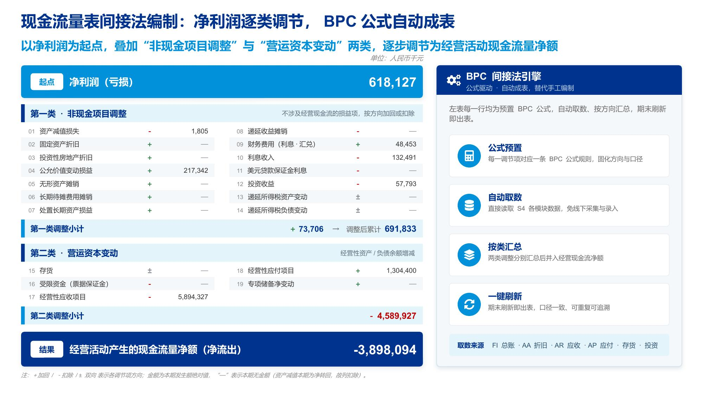
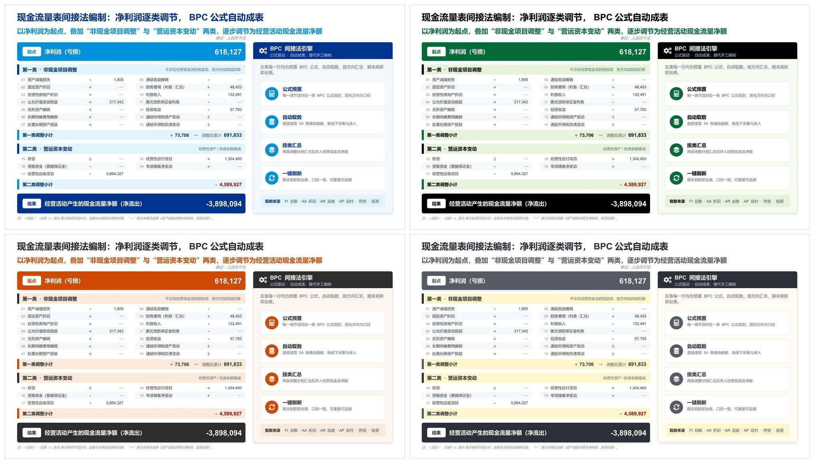

# genslides

Craft **one polished, on-brand presentation slide at a time** and deliver it as a standalone `.pptx` that merges into a master deck by hand. The defining idea: **decide visuals on a fast HTML mockup first, sign it off, then faithfully reproduce it in pptxgenjs** — gradients and brand colors stay *editable* fills, not baked images.



Ships with **four built-in Big-Four consulting styles** — **KPMG** (default) · **Deloitte** · **PwC** · **EY** — switchable via `config/theme.json`, and configurable to any brand. Same page, four themes:



This is a **Claude Code skill**, a **Claude Code plugin**, and (via `AGENTS.md`) usable from **any agent that reads the open Agent Skills format**.

## Prerequisites
- **Node.js**, **Python 3**, **LibreOffice** (`soffice`), **Google Chrome**, **poppler** (`pdftoppm`)
- A **vision-capable** model — the QA gate reads rendered slide images.
- Node deps are installed locally by `setup.py`: `pptxgenjs react react-dom react-icons sharp`
- Validation is **self-contained** — `scripts/check_pptx.py` (MIT) catches the PowerPoint-"needs-repair" failure modes plus the house checks (leftover gradient placeholders, `#` in hex, gold warning). *Optional:* if the official **`pptx` skill** is installed, `setup.py` also wires its `validate.py` for stronger full-XSD checking.

## Install

### Option A — as a plugin (recommended for teams; versioned, updatable)
```
/plugin marketplace add LEMON-FENG/genslides
/plugin install genslides@genslides-marketplace
/reload-plugins
```
Invoke with `/genslides`. Update later with `/plugin marketplace update genslides-marketplace`.

### Option B — as a bare skill (quick, personal)
```
git clone https://github.com/LEMON-FENG/genslides ~/.claude/skills/genslides
```
Auto-discovered at startup; invoke with `/genslides` — optionally with arguments: `/genslides ② --theme=pwc`.

### Then, on each machine (one-time)
```
python scripts/setup.py          (Windows wrapper: pwsh -NoProfile -File scripts/setup.ps1)
```
This installs node deps locally, **auto-detects** soffice/chrome/pdftoppm/validate.py (Windows/macOS/Linux), writes a machine-specific `config/env.json` (gitignored), installs the `slide-qa` / `slide-critic` subagent definitions into `~/.claude/agents/`, and runs the self-test.

## Verify
```
python scripts/selftest.py
```
Expect `RESULT: ALL PASS ✓` across 6 steps (generate → postprocess → house checks → validate → LibreOffice render → Chrome shoot).

## Use
Ask Claude to design/beautify/rebuild a slide, or run `/genslides [①|②] [--theme=deloitte|pwc|ey]`. The workflow (6 phases, 4 gates) is in `SKILL.md` and `reference/workflow.md`. Per page, the mechanical gate is one command:
```
python scripts/build.py gen_page.js page.pptx [--theme=config/theme.pwc.json]
```
generate → postprocess → house checks → validate → render, atomically — must end **GATE PASS**.

## Using genslides without Claude Code
`AGENTS.md` at the repo root points any other agent (Codex, Cursor, Gemini CLI, Cline, …) at `SKILL.md`; the format is the open [Agent Skills](https://agentskills.io) standard. The substance is fully portable:
- **Methodology** — `SKILL.md` + `reference/` are plain Markdown, with built-in fallbacks where Claude Code tools are named: the QA ladder in `reference/qa-prompt.md` and the design distillation `reference/design-principles.md`.
- **Scripts** — plain Node / Python, cross-platform (the `.ps1` files are thin Windows wrappers); run them by hand with no agent at all:
  ```
  python scripts/build.py templates/gen_template.js out.pptx   # the whole gate in one command
  python scripts/shoot.py page.html                            # HTML mockup → PNG
  python scripts/render.py out.pptx                            # pptx → JPGs to eyeball
  ```
- **Output** — the produced `.pptx` opens and edits in any PowerPoint / Keynote / WPS, with **no dependency** on this repo.

## Configure
- **Built-in styles** 🎨 — `config/theme.json` is **KPMG** (default). Switch per build with `--theme`:
  ```
  python scripts/build.py gen_page.js out.pptx --theme=config/theme.deloitte.json   # Deloitte (black + green)
                                               --theme=config/theme.pwc.json        # PwC (charcoal + orange)
                                               --theme=config/theme.ey.json         # EY (charcoal + yellow)
  ```
  (`GENSLIDES_THEME` env and `node gen.js --theme=` also work.) Edit any theme, or add `config/theme.<brand>.json`, to re-skin to any brand (see `reference/optional-passes.md` §C for auto-capturing a brand's palette).
- `config/env.json` — per-machine tool paths (generated by `setup.py`; never committed).

## Layout
```
SKILL.md                 orchestrator (workflow + gates + arguments)
AGENTS.md                bridge for non-Claude-Code agents
.claude-plugin/          plugin.json + marketplace.json (for plugin distribution)
agents/                  slide-qa.md (QA gate) · slide-critic.md (polish pass) — installed by setup.py
config/                  theme.json + theme.{deloitte,pwc,ey}.json (committed) · env.json (per-machine, gitignored)
reference/               workflow / house-style / title-spec / gradient-landing / pitfalls / self-check /
                         qa-prompt / design-principles / optional-passes
templates/               visualizer.html (HTML mockup) · gen_template.js (pptxgenjs house template)
scripts/                 Python canonical: setup.py · selftest.py · build.py ⭐ · shoot.py · render.py ·
                         postprocess.py · check_pptx.py · extract_deck_style.py
                         Node helpers: sample_color.js · capture_palette.js      (.ps1 = Windows wrappers)
```

## Re-brand / fork
To target a different brand or another GitHub owner: replace the owner in `.claude-plugin/plugin.json`,
`.claude-plugin/marketplace.json`, and this README, and re-skin `config/theme.json` (or use the
brand-capture pass in `reference/optional-passes.md` §C). The KPMG default lives in `config/theme.json`.

## Portability notes
- Scripts resolve their own location — no absolute paths in code; the only machine-specific values live in `config/env.json` (generated).
- Keep **end-client** names out of the repo (engagement facts go in the working folder). The firm brand (KPMG) is the default and is fine to name.
